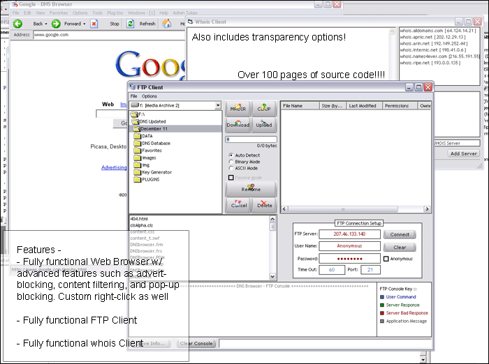



## DNS Browser

### Description

Project Description: This project was originally intended to be a way for

me to access the internet at my workstation in college because they had

disabled DNS and I had to find a way around this. So I decided to make a

browser that would get the IP address for the DNS and would place it in a

database which the browser would search through to decide where to navigate.

Well, after spending over two months working on it I've added many different

features and a lot of code that I think many people will find useful.

NOTED FEATURES -

1. Fully functional web browser which can be set to DNS or Normal Browsing Mode.

2. Fully functional FTP client included.

3. A whoIs client that is fully functional and includes 6 servers.

4. Implemented own "favorites" system which isn't very good but oh well, lol.

5. Implementation of many additional features for browser such as "style changing"

for people who cannot read well and extracting links, emails, or image urls.

6. Implementation of pop-up blocker as well as a feature to filter website content.

7. Some features you will have to find on your own because I never got around to

making a help file or anything for this. So just search through the code and see

what you can find. Notably, check the form keypress section.

8. PASSWORD FOR FILTERING IN BROWSER OPTIONS IS (CASE-SENSITIVE): "admin"

9. Also included is the feature to block ad-banners and ad-text but must be uncommented

to be active. I didn't have the time to include it in the options.

BUGS: There are MANY bugs in this program as you might imagine because the code is

quite large (over 120 pages when pasted in Microsoft Word). So please just tell me

if you find any bugs but please don't criticize me for them. Note that I grabbed a

few things from PSC and have noted it below.

NOTED UNFINISHED WORK: (1) FTP is fully functional but the file listing does not

always work properly and I never got around to finishing that. (2) The "clean-up" bit

in the Browser Options was never completed and little features like the (3) updating

browser weekly and (4) backing up files weekly was never fully completed. (5) I was

intending on creating a mini-chat application between browser users but never got

around to even starting it. (6) Adding whois servers has not yet been included. (7)

Was going to add a history feature but never got around to that either. Wow, so many

things, lol.

CREDITS: I give credit to whoever's code the Alpha Transparancy is as I did not make

that. I also give credit to the person who provided the "isButton" control as I also

did not write that. And finally I give credit to the person who provided the .RES

for the XP Manifest code.

Extra Comments: This is my second largest project I've made and I've spent about

two months or so working on it so I hope you appreciate me distributing

this code. So before you close this program and go onto doing whatever else

you do, please vote for me!

CONTACT: Email - SeoulxKorean@yahoo.com AIM - xAznHangukBoix
 
### More Info
 

             |
---                |---
**Submitted On**   |2004-12-30 15:20:28
**By**             |[Daniel M](https://github.com/Planet-Source-Code/PSCIndex/blob/master/ByAuthor/daniel-m.md)
**Level**          |Advanced
**User Rating**    |4.7 (108 globes from 23 users)
**Compatibility**  |VB 6\.0
**Category**       |[Internet/ HTML](https://github.com/Planet-Source-Code/PSCIndex/blob/master/ByCategory/internet-html__1-34.md)
**World**          |[Visual Basic](https://github.com/Planet-Source-Code/PSCIndex/blob/master/ByWorld/visual-basic.md)
**Archive File**   |[DNS\_Browse18346512302004\.zip](https://github.com/Planet-Source-Code/daniel-m-dns-browser__1-57949/archive/master.zip)

